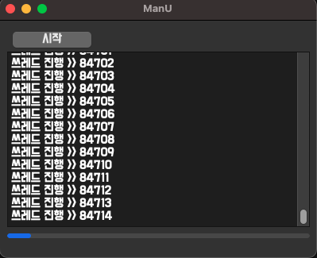

# 빅데이터 언어 2024
빅데이터 자바 개발자 파이썬 학습 리포지토리

## 1일차
# 파이썬 개발환경
   - [깃허브](https://github.com/) 가입
   - [깃](https://docs.github.com/ko/desktop/installing-and-authenticating-to-github-desktop/installing-github-desktop) 설치
   - [깃헙 데스크탑](https://desktop.github.com/) 설치
   - [파이썬](https://pyhton.org) 설치
   - [visual studio](https://code.visualstudio.com/download) 설치
   - [나눔고딕코딩](https://githubs.com/naver/nanumfont) 글자체 설치

# 파이썬 개요
   - 1990년 암스테르담의 '귀도 반 로섬'이 개발한 인터프리터 언어.
   - 공동작업과 유지보수가 매우 편리.
   - 쉽고 간결한 문법, 무료지만 빠른 개발속도

# 파이썬 기초문법
    - 숫자형
      - 정수형
      - 실수형
      - 사칙연산
   ```python
   # 변수만 선언, 값만 할당하면 숫자형으로 지정
   # C, C++, Java, C# 처럼 형 지정이 없음!
   Val = 10 # 정수형
   Val = 2.15 # 실수형
   binVal = 0b11111111 # =255 (2진수)
   ```
   - 문자형
      - 문자열 연산
      - 문자열 인덱싱과 슬라이싱
      - 문자열 포매팅
   ```python
      ## f포매팅 3.6(2016)버전 이후에 나온 최신 방식 
         name = '홍길동'
         age = 30
         cont = f'나는 {name}이고, 나이는 {age} 입니다.'
         print(cont)name = '김동건'
         age = 20
         cont = f'나는 {name}이고, 나이는 {age} 입니다.'
         print(cont)
         print(f'나는 {name:>10}이고, 나이는 {age:03d}세 입니다.') # name 앞 10자리 띄어쓰기
         print(f'나는 {name:<10}이고, 나이는 {age:03.1f}세 입니다.') # name 뒤 10자리 띄어쓰기
         # 정수는 f포맷 사용가능, 실수는 d포맷 사용불가
   ```

      - 리스트형, 튜플형 (연산, 함수)
         - 리스트는 수정이나 삭제 가능
         - 튜플은 수정이나 삭제 불가능, 그 외에는 리스트와 동일


## 2일차
- 파이썬 학습
   - 파이썬 기초문법
   - 딕셔너리, 집합
      - Key, Value를 한쌍으로 가지는 자료형
         ```python
            spiderMan = {'name': 'Petter Parker', 'age': 18, 'weapon': 'Web shooter', 'freind': ["ironMan", 'Thor','Captain America']}
            print(spiderMan)
            print(spiderMan['name'])
         ```
      - 집합은 중복을 허용하지 않고, 순서가 정해지지 않는다.
   - 불형
      - 참, 거짓을 나타내는 자료형
   - None형
   - 제어문
      - if문, for문, while문
      - 제어문 연습

## 3일차
- 파이썬 학습
   - 파이썬 기초 문법
   - 입출력
   - 객체 지향

## 4일차
- 파이썬 학습
   - 파이썬 기초 문법
   - 모듈,패키지
      - 모듈을 패키지로 만들 필요X, 함수들만 모아놔도 OK
      - if__name__ == java에서 void main()
   - ⭐️ 예외처리, 디버깅 ⭐️
   - 내장함수

## 5일차
- 파이썬 학습
   - OS내 디렉토리 검색
   - 아스키 및 유니코드
   - 주소록 앱 만들기
      ```python
      class Contact: # 주소록 클래스
      def __init__(self, name, phoneNumber, eMail, addr) -> None: # 생성자
         self.__name = name
         self.__phoneNumber = phoneNumber
         self.__eMail = eMail
         self.__addr = addr

      def __str__(self) -> str: # 원래출력 <__main__.Contact object at 0x0000024500772150> 
         res = (f'이  름 : {self.__name}\n'
               f'핸드폰 : {self.__phoneNumber}\n'
               f'이메일 : {self.__eMail}\n'
               f'주  소 : {self.__addr}')
         return res
      
      def isNameExist(self, name): # 연락처 여부확인
         if self.__name == name: # 찾는 이름 존재
               return True
         else:
               return False
         
      def getInfo(self):
         return self.__name, self.__phoneNumber, self.__eMail, self.__addr
      ```


## 6일차 (24.02.28)
- 파이썬 학습
   - PyQt5 학습 
      - QWidget 자식 클래스 종류 학습
      - PyQt5Designer 설치
         - Mac Os에서 [PyQt5Designer](https://build-system.fman.io/qt-designer-download) 설치
      
      - QLabel 만들기

      
         
   - Naver 뉴스 API 검색 앱      
         
      


   - [보안 문제 ssl 오류 뜰때 해결법](https://sooeun67.github.io/data%20analysis/solve-ssl-certificate-error/)
      ```python
         imtport ssl
         ssl._create_default_https_context = ssl._create_unverified_context # ssl 함수 생성
      ```
      


## 7일차
# 파이썬 응용
   - PyQt5 학습
   - Naver 뉴스 API 검색 앱 마무리
   - 스레드 개념 및 학습
      - NoThreadApp _ 응답 X


      

         
         
      - ThreadApp _ 응답 Ok

      
         

   - json 학습
   - json 데이터 접근은 파이썬 dictionary, list와 동일하게 사용가능
      ```python
         {
         "ManU": {
            "LigueWinner": 20,
            "UclWineer": 3,
            "TopPlayer": "Bruno"
         },
         "Tottenham": {
            "LigueWinner": 0,
            "UclWineer": 0,
            "BestPlayer": "Maddison"
         }
      }
      ```
   - TTS 학습
      ```python
         from gtts import gTTS

         text = input('소리로 바꿀 텍스트 입력 > ')

         speech = gTTS(text=text, lang='ko')
         speech.save('./day07/tts.mp3')
      ```
   - QR 코드 생성
      
      
      

   - 구글 번역기 만들기
      
      
      

## 8일차
# 파이썬 응용
   - PyAutoGui 모듈(마우스, 키보드, 화면캡처)
   - 슬랙 webhook으로 모바일 메시지 보내기
   <!---->
   <!-- html 태그로 이미지를 삽입하면 문제없음 -->
   
   
   
   - Tesseract 프로그램으로 이미지에서 글자 추출 (인식율을 높히려면 직접 트레이닝을 해서 트레이닝 데이터를 만들어야함)


   

## 9일차
# 파이썬 응용
   - 이미지 처리 OpenCV [OpenCV 설치 - superMemi's study님 t-story 참조](https://supermemi.tistory.com/entry/M1-MacBook-OpenCV-%EC%84%A4%EC%B9%98%ED%95%98%EA%B8%B0)


   


   - [Flask](https://flask-docs-kr.readthedocs.io/ko/latest/index.html), [Django](https://developer.mozilla.org/ko/docs/Learn/Server-side/Django) 웹서버
   - 그림 에디터 만들기 (with PyQt5)
      ```python
      ## qrc파일 사용 >> 터미널 >> pyrcc5 "pyrcc5 "resources.qrc" -o "resources_rc.py"
      import resources_rc
      ```

      
## 10일차
# 파이썬 응용 
   - 메모장 만들기
   - Jupyter Notebook 사용법(빅데이터 분석, 코딩테스트)